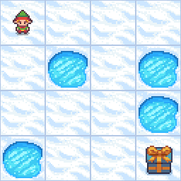
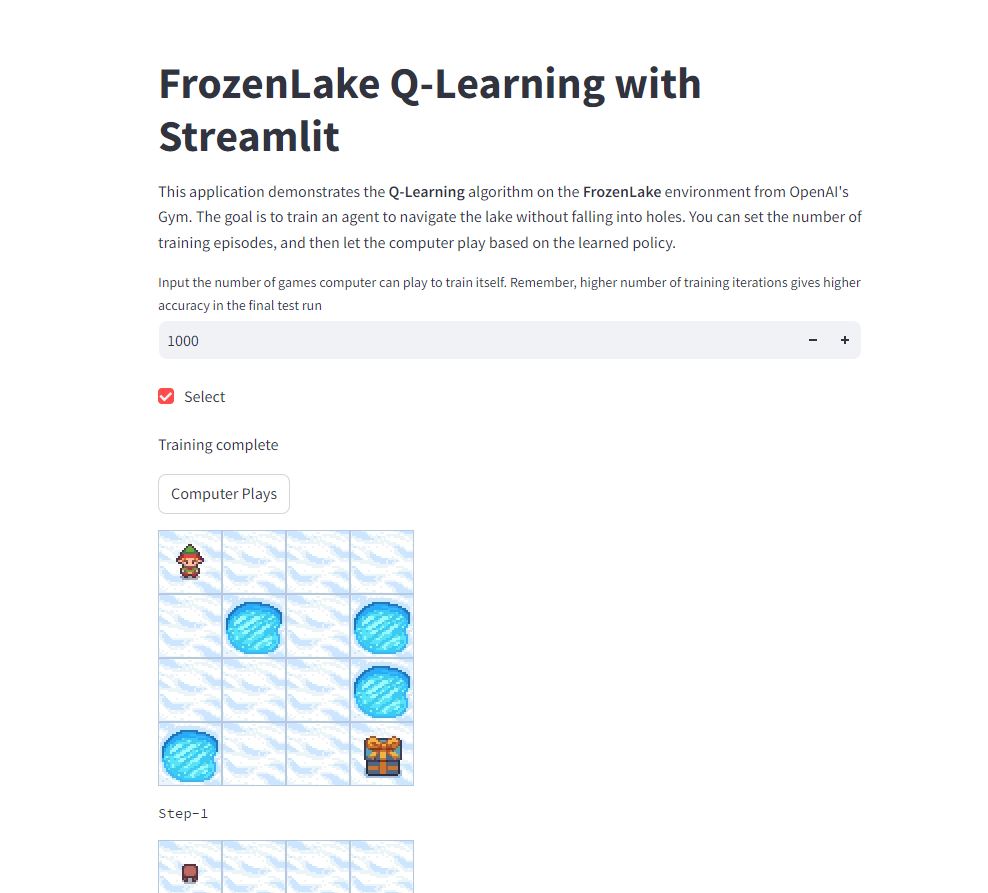

# FrozenLake Q-Learning

This project implements a Q-learning algorithm to solve the FrozenLake-v1 environment from OpenAI's Gymnasium. The agent is trained to navigate a 4x4 grid of ice to reach the goal while avoiding holes, using a reinforcement learning approach.

## Overview

- **Environment**: FrozenLake-v1 (4x4 map, deterministic movements)
- **Algorithm**: Q-learning with epsilon-greedy exploration
- **Training Output**: A Q-table that learns the optimal actions for each state
- **Visualization**: Training and testing results are saved as gifs (`training.png` and `test.png`)

The agent learns through multiple episodes by interacting with the environment, updating its Q-table based on rewards and future expectations. After training, it navigates the frozen lake efficiently by following the optimal learned policy.

## Visualizations

The following images demonstrate the training and testing phases of the Q-learning algorithm:

- **Training Progress**: Shows how the agent learns to navigate the frozen lake over training episodes.
  - 

- **Testing Performance**: Shows how the agent performs after training for 1000 episodes.
  - 

## Streamlit App

An interactive Streamlit app is available to visualize and interact with the Q-learning process:

- **[Play with the Streamlit App](https://sameerrawat07-q-learning.hf.space)**

### How to Use the Streamlit App

1. **Training**: Input the number of training episodes and click "Select" to train the agent. Higher numbers of episodes generally improve the agent's performance.
2. **Play**: After training, click "Computer Plays" to watch the agent navigate the FrozenLake environment using the learned policy. You can see the agent's steps and its environment renderings.

## Resources
The theoretical background and code for this project are largely based on the following resource:
- [Hugging Face Deep Reinforcement Learning Course](https://huggingface.co/learn/deep-rl-course/unit0/introduction)

# Update

In extension to classical Q-Learning, there is Deep Q-Learning (DQN) to address environments with larger state spaces. DQN leverages neural networks to approximate the Q-values, making it feasible to handle more complex problems where a Q-table would be impractical.

For more details, including the implementation code and additional documentation, please visit the [Deep Q-Learning Repository](https://github.com/SameerR007/deep-q-learning).